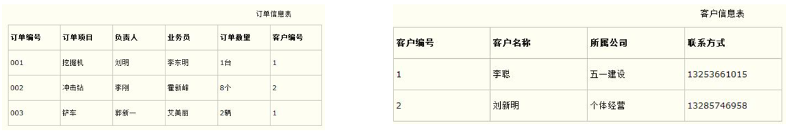
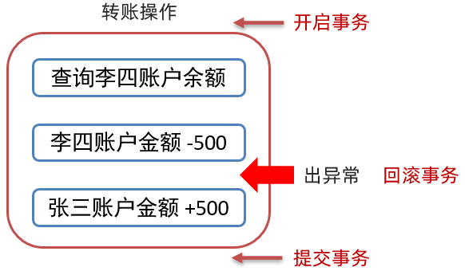
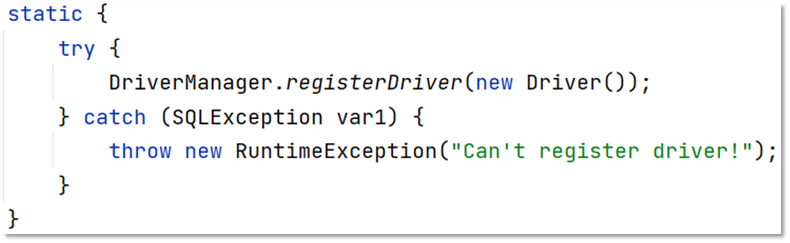
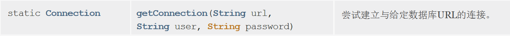

# 数据库字段名与Java变量名

- **数据库**

  ```
  全部小写，两个单词拼接的用_。
  如 brand_name; company_name
  ```

- **Java**

  ```
  全部变量驼峰命名法——brandName;companyName
  ```

在定义实体类与数据库表对应的时候，需要注意哦

# 数据库相关概念

以前我们做系统，数据持久化的存储采用的是**文件存储**。存储到文件中可以达到系统关闭数据不会丢失的效果，当然文件存储也有它的弊端。

当我们需要修改文件的某条数据时，我们使用IO技术可以通过将所有的数据读取到内存中，然后进行修改再存到该文件中。通过这种方式操作存在很大问题，如果文件中存储1T的数据，那么就会发现内存根本就存储不了及其不便利。

**数据库技术就是为了解决数据持久化存储问题和文件存储CRUD困难的技术。**

数据库技术包含两个东西：

1. 数据库；——解决数据持久化存储问题，
2. 数据库管理系统；——极大便利CRUD

## 数据库

- **存储和管理数据的仓库，数据是有组织的进行存储。**
- 数据库英文名是 DataBase，简称DB。

## 数据库管理系统

- **管理数据库的大型软件**
- 英文：DataBase Management System，简称 DBMS

在电脑上安装了数据库管理系统后，就可以通过数据库管理系统创建数据库来存储数据，也可以通过该系统对数据库中的数据进行数据的增删改查相关的操作。**我们平时说的MySQL数据库其实是MySQL数据库管理系统。**


**常见的数据库管理系统：**


接下来对上面列举的数据库管理系统进行简单的介绍：

- Oracle：收费的大型数据库，Oracle 公司的产品
- **MySQL： 开源免费的中小型数据库。后来 Sun公司收购了 MySQL，而 Sun 公司又被 Oracle 收购**
- SQL Server：MicroSoft 公司收费的中型的数据库。C#、.net 等语言常使用
- PostgreSQL：开源免费中小型的数据库
- DB2：IBM 公司的大型收费数据库产品
- SQLite：嵌入式的微型数据库。如：作为 Android 内置数据库
- MariaDB：开源免费中小型的数据库

这么多的管理系统，怎么学的完呢，对不对？，所以我们统一了一门编程语言（SQL）来操作所有的DBMS。整理一下，**用户、DBMS、DB的关系**，如下：


用户通过SQL语言跟数据库管理系统（DMBS）打交道 ；然后DBMS识别用户的命令，来对数据库（DB）进行增删改查的操作。

## **SQL**

- **英文：Structured Query Language，简称 SQL，结构化查询语言**
- 操作关系型数据库的编程语言
- 定义操作所有关系型数据库的统一标准，可以使用SQL操作所有的关系型数据库管理系统，以后工作中如果使用到了其他的数据库管理系统，也同样的使用SQL来操作。
- 大部分数据库管理系统的sql语句都是一样的，但是也存在部分的需求，它的语法规则不一样，这种我们称为——数据库管理系统的方言。

# MYSQL

## MySQL数据模型

**一：关系型数据库：**

关系型数据库是建立在关系模型基础上的数据库，简单说，关系型数据库是由多张能互相连接的 **二维表** 组成的数据库。即数据库里面存储的都是有行有列的二维表，表之间存在一定联系。



接下来看关系型数据库的优点：

- **都是使用表结构，格式一致，易于维护。**

- 使用通用的 SQL 语言操作，使用方便，可用于**复杂查询。**

如现在需要查询001号订单数据，我们可以看到该订单是1号客户的订单，而1号订单是李聪这个客户。以后也可以在一张表中进行统计分析等操作。

**现在总结一下，MYSQL的整体数据模型：**


前面讲过，客户端通过SQL语言操作DBMS，然后他再对数据库执行相应的操作。举个例子：

```sql
create database db1;
```

这样就在数据库按照目录下的data文件下，新建一个db1的文件夹；**即在MySQL中一个数据库对应到磁盘上的一个文件夹。**

然后一个数据库下可以创建多张表，我们到MySQL中自带的mysql数据库的文件夹目录下：


上图中右边的 **db.frm 是表文件**， **db.MYD 是数据文件**，通过这两个文件就可以查询到数据展示成二维表的效果。

**小结：**

1. **MySQL中可以创建多个数据库，每个数据库对应到磁盘上的一个文件夹**
2. **在每个数据库中可以创建多个表，每张都对应到磁盘上一个 frm 文件**
3. **每张表可以存储多条数据，数据会被存储到磁盘中 MYD 文件中**

## MySQL数据类型

MySQL 支持多种类型，可以分为三类：

下面是简单的举例，还有很多其他类型，查看同目录下的《MySQL数据类型.xlsx》。

### 数值

```sql
tinyint	:小整数型，占一个字节 
int			:大整数类型，占四个字节 
						eg ： age int 
double	:浮点类型 
				使用格式： 字段名 double(总长度,小数点后保留的位数) 
						eg ： score double(5,2)
```

### 日期

```sql
date			:日期值。只包含年月日 
							eg ：birthday date 
datetime	:混合日期和时间值。包含"年-月-日-时-分-秒"
```

### 字符串

```sql
char		:定长字符串。 
				优点：存储性能高 
				缺点：浪费空间 
					eg ： name char(10) 
				如果存储的数据字符个数不足10个，也会占10个的空间 
varchar	:变长字符串。 
				优点：节约空间 
				缺点：存储性能低 
					eg ： name varchar(10) 
				如果存储的数据字符个数不足10个，那就数据字符个数是几就占几个的空间 
```


# SQL语句

## 通用语法

- **SQL 语句可以单行或多行书写，以分号结尾，并且一条sql语句，内部是使用逗号 ， 进行分割，内部的最后部分不要加逗号，哦**。注意哦，cmd命令窗口是不要加分号的。

  ```sql
  show databases;
  ```

- **MySQL 数据库的 SQL 语句不区分大小写**，关键字建议使用大写。

  ```sql
  Show DataBases;
  ```

- **单行注释：**     **-- 注释内容** 或   **#注释内容**(MySQL 特有)【注意：--后面一定加空格，#没有要求】

  ```sql
  show databases;-- 查询所有的数据库名称
  show databases; #查询所有的数据库名称
  ```

- **多行注释：**   /*  注释  */

## SQL分类

- **DDL(Data Definition Language) ：** 数据定义语言，用来定义数据库对象：数据库，表，列等，**DDL简单理解就是用来操作数据库， 表 等**
- **DML(Data Manipulation Language)** ：数据操作语言，用来对数据库中表的数据进行增删改，**DML简单理解就对表中数据进行，增删改**

- **DQL(Data Query Language)** 数据查询语言，用来查询数据库中表的记录(数据)；**DQL简单理解就是对数据进行查询操作。**


- **DCL(Data Control Language)** 数据控制语言，用来定义数据库的访问权限和安全级别，及创建用户。**DML简单理解就是对数据库进行权限控制**。比如我让某一个数据库表只能让某一个用户进行操作等。

**重点： DML 和 DQL** 

### DDL：操作数据库

操作数据库主要就是对数据库的增删查操作。

1. 查询所有的数据库：

   ```sql
   SHOW DATABASES;
   ```

2. 创建数据库 (判断，如果不存在则创建)：

   ```sql
   CREATE DATABASE IF NOT EXISTS 数据库名称;
   ```

3. 删除数据库(判断，如果存在则删除)

   ```sql
   DROP DATABASE IF EXISTS 数据库名称;
   ```

4. 进入使用数据库：

   ```sql
   USE 数据库名称;
   ```

5. 查看当前使用的数据库：

   ```sql
   SELECT DATABASE();
   ```

### DDL：操作表

操作表也就是对表进行增（Create）删（Retrieve）改（Update）查（Delete）。

1. **查询当前数据库下所有表名称**

   ```sql
   SHOW TABLES;
   ```

2. **查询表结构**

   ```sql
   DESC 表名称;
   ```

   查看mysql数据库中func表的结构，运行语句如下：


3. **创建表**

   ```sql
   CREATE TABLE 表名 ( 
     字段名1 数据类型1, 
     字段名2 数据类型2, 
     …
     字段名n 数据类型n 
   );
   -- 注意：最后一行末尾，不能加逗号
   ```

4. **删除表**

   ```sql
   DROP TABLE IF EXISTS 表名;
   ```

5. **修改表**

   ​	**修改表名:**	RENAME TO

   ```sql
   ALTER TABLE 表名 RENAME TO 新的表名; 
   
   -- 将表名student修改为stu 
   alter table student rename to stu;
   ```

   ​	**添加一列:**	ADD

   ```sql
   ALTER TABLE 表名 ADD 列名 数据类型; 
   
   -- 给stu表添加一列address，该字段类型是varchar(50) 
   alter table stu add address varchar(50);
   ```

   ​	**修改数据类型:**	MODIFY

   ```sql
   ALTER TABLE 表名 MODIFY 列名 新数据类型; 
   
   -- 将stu表中的address字段的类型改为 char(50) 
   alter table stu modify address char(50);
   ```

   ​	**修改列名和数据类型:**	CHANGE

   ```sql
   ALTER TABLE 表名 CHANGE 列名 新列名 新数据类型;
   
   -- 将stu表中的address字段名改为 addr，类型改为varchar(50) 
   alter table stu change address addr varchar(50);
   ```

   ​	**删除列:**

   ```sql
   ALTER TABLE 表名 DROP 列名; 
   
   -- 将stu表中的addr字段 删除 
   alter table stu drop addr;
   ```

### DML

**对表中数据进行，增、删、改**

#### 添加数据

- **给指定列添加数据**

  ```sql
  INSERT INTO 表名(列名1,列名2,…) VALUES(值1,值2,…);
  ```

- **给全部列添加数据**

  ```sql
  INSERT INTO 表名 VALUES(值1,值2,…);
  ```

- **批量添加数据**

  ```sql
  INSERT INTO 表名(列名1,列名2,…) VALUES(值1,值2,…),(值1,值2,…),(值1,值2,…)…; 
  INSERT INTO 表名 VALUES(值1,值2,…),(值1,值2,…),(值1,值2,…)…;
  ```

#### 修改数据

- **修改表数据**

  ```sql
  UPDATE 表名 SET 列名1=值1,列名2=值2,… [WHERE 条件];
  ```

注意：

1. 修改语句中如果不加条件，则将所有数据都修改！
2. 中括号表示里面的语句 可要可不要；这个中括号一般省略不写

**Example：**

```sql
#将张三的性别改为女
update stu set sex="女" where name = "张三";
#将张三的生日改为 1999-12-12 分数改为99.99
update stu set birthday = "1999-12-12", score = 99.99 where name = "张三";
#注意：如果update语句没有加where条件，则会将表中所有数据全部修改！
update stu set sex = "女";
```

#### 删除数据

```sql
DELETE FROM 表名 WHERE 条件 ; 
```

```sql
-- 删除张三记录 
delete from stu where name = '张三'; 
-- 删除stu表中所有的数据 
delete from stu;
```

### DQL(重点)

查询这里是最重要的啊，因为他是特别灵活的一类，例如在我们的前端页面展示所有数据库里面的数据，然后分页展示数据，排序展示数据等等，需要实现定制化的效果。需要特别重点掌握。

**先介绍查询的完整语法：**

```sql
SELECT
		字段列表 
FROM
		表名列表 
WHERE
		条件列表 （条件查询）
GROUP BY 
		分组字段 （分组查询）
HAVING
		分组后条件 
ORDER BY 
		排序字段 （排序查询）
LIMIT
		分页限定 （分页查询）
```

下面各自查询操作，均基于下面这个表进行。

 ```sql
 -- 删除stu表
 drop table if exists stu;
 
 
 -- 创建stu表
 CREATE TABLE stu (
  id int, -- 编号
  name varchar(20), -- 姓名
  age int, -- 年龄
  sex varchar(5), -- 性别
  address varchar(100), -- 地址
  math double(5,2), -- 数学成绩
  english double(5,2), -- 英语成绩
  hire_date date -- 入学时间
 );
 
 -- 添加数据
 INSERT INTO stu(id,NAME,age,sex,address,math,english,hire_date) 
 VALUES 
 (1,'马运',55,'男','杭州',66,78,'1995-09-01'),
 (2,'马花疼',45,'女','深圳',98,87,'1998-09-01'),
 (3,'马斯克',55,'男','香港',56,77,'1999-09-02'),
 (4,'柳白',20,'女','湖南',76,65,'1997-09-05'),
 (5,'柳青',20,'男','湖南',86,NULL,'1998-09-01'),
 (6,'刘德花',57,'男','香港',99,99,'1998-09-01'),
 (7,'张学右',22,'女','香港',99,99,'1998-09-01'),
 (8,'德玛西亚',18,'男','南京',56,65,'1994-09-02');
 ```

#### 基础查询

- **查询多个字段**

```sql
SELECT 字段列名 FROM 表名; 
# select name,age from stu;
SELECT * FROM 表名; -- 查询所有数据
```

- **去除重复记录**

```sql
SELECT DISTINCT 字段列名 FROM 表名;
```

- **起别名**

```sql
AS: AS 
中间的冒号：也可以省略,但不建议省略，这样可读性强
# select name,math as 数学成绩,english as 英文成绩 from stu;
```

#### 条件查询

```sql
SELECT 字段列表 FROM 表名 WHERE 条件列表;
```

其中，条件列表可以使用以下运算符：

​				==between...and...——可用于时间段查询==


**练习一：**

- **查询年龄大于等于20岁 并且 年龄 小于等于 30岁 的学员信息**

```sql
#1. 
select * from stu where age >= 20 and age <= 30;
#2. 
select * from stu where age BETWEEN 20 and 30;
```

- **查询入学日期在'1998-09-01' 到 '1999-09-01' 之间的学员信息**

```sql
select * from stu where hire_date BETWEEN '1998-09-01' and '1999-09-01';
```

- **查询年龄等于18岁 或20岁 或 22岁的学员信息**

```sql
select * from stu where age in (18,20,22);
```

- **查询英语成绩为 null的学员信息**

​		注意：null值的比较不能使用 = 或者 != ，需要使用 is 或者 is not。其他情况使用 = 或！=

```sql
select * from stu where english = null; -- 这个语句是不行的 
select * from stu where english is null; 
select * from stu where english is not null;
##
select * from stu where age != 18;
```

**模糊查询练习二：**

```
模糊查询使用like关键字，可以使用通配符进行占位: 
（1）_ : 代表单个任意字符
（2）% : 代表任意个数字符
```

- **查询姓'马'的学员信息**

```sql
select * from stu where name like "马%";
```

- **查询第二个字是'花'的学员信息**

```sql
select * from stu where name like '_花%';
```

- **查询名字中包含 '德' 的学员信息**

```sql
select * from stu where name like "%德%";
```

#### 排序查询

```sql
SELECT 字段列表 FROM 表名 ORDER BY 排序字段名1 [排序方式1],排序字段名2 [排序方式2] …;
```

上述语句中的排序方式有两种，分别是：

1. **ASC** ： 升序排列 **（默认值）**——ascending sort
2. **DESC** ： 降序排列——descending sort

**注意：如果有多个排序条件，当前边的条件值一样时，才会根据第二条件进行排序**，就是说，假如你写了两种方式排序，优先按照第一种来，当第一种出现了两个或以上数据排序一样时，再按照第二种对这几个相同的数据排序。

**Example：**

- **查询学生信息，按照数学成绩降序排列，如果数学成绩一样，再按照英语成绩升序排列**

  ```sql
  select * from stu order by math desc , english asc ;
  ```

#### 分组查询

##### 聚合函数

学习分组查询前，先要学习一个东西——**聚合函数**。

简单说：**将一列数据作为一个整体，进行纵向计算。**

举个例子说明：假如有下表：


现有一需求让我们求表中所有数据的数学成绩的总和。这就是对math字段进行纵向求和。

**聚合函数分类：**


**语法：**	**特别特别注意：null 值不参与所有聚合函数运算**

```sql
SELECT  聚合函数名(列名)  FROM 表;
```

**Example：**

- **统计班级一共有多少个学生**

```sql
select count(*) from stu; 
# 下面这种方式是不行的哦，因为假如统计的这个字段是null，而其他的字段内容不为空，就会少统计一个学生，这个意思。
select count(id) from stu;
```

==* 表示所有字段数据，即只有当这条数据的所有字段列表全为null时才不统计，只要有一个字段不为0，就会统计该条数据。==

- **查询数学成绩的最高分**

  ```sql
  select max(math) from stu;
  ```

- **查询数学成绩的平均分**

  ```sql
  select avg(math) from stu;
  ```

##### **语法**

```sql
SELECT 字段列表 FROM 表名 [WHERE 分组前条件限定] GROUP BY 分组字段名 [HAVING 分组后条件过滤]; 
```

**注意：分组之后，查询的字段（即上面的字段列表）为聚合函数和分组字段，查询其他字段无任何意义。**

where 就是前面的条件查询语句。having后面的除了条件查询语句写法，还可以写聚合函数。

**where和having的区别**

- 执行时机不一样：where 是分组之前进行限定，不满足where条件，则不参与分组，而having是分组之后对结果进行过滤。
- 可判断的条件不一样：where 不能对聚合函数进行判断，having 可以。

**写分组查询sql的顺序：**

```sql
1. 
select   from stu group by sex;
		#表示将sex这个字段这一列，按照存储内容的不同分组。现在sex字段存储的数据只有男、女，所以会自动把他分为两组。
2.
select sex,avg(math) from stu group by sex;
		#然后再写，我对这两个分组之后做的操作，select查询的字段列表只能是，聚和函数和分组字段，注意哦：现在这个sex不是对应表里面那个字段下的所有数据哦，他是指的分组名。
```

上面语句的输出如下：


现在学会了书写顺序后，再看看下面的几个例子。

**Example：**

- **查询男同学和女同学各自的数学平均分，以及各自人数**

  ```sql
  select sex,avg(math),COUNT(*) from stu GROUP BY sex;
  ```

- **查询男同学和女同学各自的数学平均分，以及各自人数，要求：分数低于70分的不参与分组**

  ```sql
  select sex,avg(math),COUNT(*) from stu where math >= 70 GROUP BY sex;
  ```

- **查询男同学和女同学各自的数学平均分，以及各自人数，要求：分数低于70分的不参与分组，分组之后人数大于2个的**

  ```sql
  select sex,avg(math),COUNT(*) from stu where math >= 70 GROUP BY sex HAVING count(*)>2;
  ```

#### 分页查询

```sql
SELECT 字段列表 FROM 表名 LIMIT 起始索引 , 查询条目数;
```

其中起始索引是从0开始，他是mysql内部它自己标示每一条数据的索引（我们是看不见的）；查询条目就是每一页你要显示的数据个数。

所以说：当我们需要查询第三页的数据，每页显示3条时，应该怎么写呢：

```sql
select * from stu limit 6,3;
```

# Navicat的简单使用

1. **修改表的结构**


点击了设计表后即出现如下图所示界面，在图中红框中直接修改字段名，类型等信息：


2. **编写SQL语句并执行**


# MySQL高级

## 1. 约束

注意到，我们前面用的数据库的那个表，是我们自己写的，对不对，并且所有的字段里面的数据都可以随便写，例如id可以写1，2，3甚至可以重复写，这就存在很多问题。以我们前面那个stu表为例子。


表中数据存在一些问题：

* id 列一般是用标示数据的唯一性的，而上述表中的id为1的有三条数据，并且 `马花疼` 没有id进行标示
* `柳白` 这条数据的age列的数据是3000，而人也不可能活到3000岁
* `马运`  这条数据的math数学成绩是-5，而数学学得再不好也不可能出现负分

* `柳青` 这条数据的english列（英文成绩）值为null，而成绩即使没考也得是0分

针对上述数据问题，我们就可以从数据库层面在添加数据的时候进行限制，这个就是约束。

### 1.1 概述

* 约束就是表中字段列上的规则，用于限制加入表的数据

  ​		例如：我们可以给id列加约束，让其值不能重复，不能为null值。

* 约束的存在保证了数据库中数据的正确性、有效性和完整性

  ​		添加约束可以在添加数据的时候就限制不正确的数据，年龄是3000，数学成绩是-5分这样无效的数据，继而保障数据的完整性。

### 1.2 约束的分类

1. **非空约束： 关键字是 NOT NULL**

   保证列中所有的数据不能有null值。

2. **唯一约束：关键字是  UNIQUE**

   保证该列中所有数据各不相同。

3. **主键约束： 关键字是  PRIMARY KEY**

   主键是一行数据的唯一标识，非空且唯一。一张表只能有一个主键。

4. **检查约束： 关键字是  CHECK** 

   保证字段列中的值满足某一条件。

   例如：我们可以给age列添加一个范围，最低年龄可以设置为1，最大年龄就可以设置为300，这样的数据才更合理些。

   > 注意：MySQL不支持检查约束。
   >
   > 这样是不是就没办法保证年龄在指定的范围内了？从数据库层面不能保证，以后可以在java代码中进行限制，一样也可以实现要求。

5. **默认约束： 关键字是   DEFAULT**

   保存数据时，未指定值则采用默认值。

   例如：我们在给english列添加该约束，指定默认值是0，这样在添加数据时没有指定具体值时就会采用默认给定的0。

6. **外键约束： 关键字是  FOREIGN KEY**

   外键用来让两个表的数据之间建立链接，保证数据的一致性和完整性。后面我们会重点进行讲解。

7. **额外介绍一个：自动增长,     关键字：AUTO_INCREMENT**

   只有当该字段的数据为数字类型，且唯一的时候，才可以加这个约束。作用是：当我们插入数据时，该字段数据为null，他就会按照数据插入库的顺序去给字段添加值。

### 1.3 非空约束

**关键字是 NOT NULL**，保证列中所有的数据不能有null值。

语法：

- 添加约束

  ```sql
  -- 创建表时添加非空约束
  CREATE TABLE 表名(
     列名 数据类型 NOT NULL,
     …
  ); 
  ```

  ```sql
  -- 建完表后添加非空约束
  ALTER TABLE 表名 MODIFY 字段名 数据类型 NOT NULL;
  ```

- 删除约束

  ```sql
  ALTER TABLE 表名 MODIFY 字段名 数据类型;
  ```

### 1.4 唯一约束

**关键字是  UNIQUE**，保证该列中所有数据各不相同。

语法：

- 添加约束

  ```sql
  -- 创建表时添加唯一约束
  CREATE TABLE 表名(
     列名 数据类型 UNIQUE,
     …
  ); 
  --
  create table stu(
  	id int unique,
    ....
  );
  ```

  ```sql
  -- 建完表后添加唯一约束
  ALTER TABLE 表名 MODIFY 字段名 数据类型 UNIQUE;
  --
  alter table stu modify id int unique;
  ```

- 删除约束

  ```sql
  ALTER TABLE 表名 DROP INDEX 唯一约束字段名;
  --
  alter table stu drop index id;
  ```

### 1.5 主键约束

**关键字是  PRIMARY KEY**，主键是一行数据的唯一标识，**非空且唯一**。一张表只能有一个主键。

**语法**

- 添加约束

  ```sql
  -- 创建表时添加主键约束
  CREATE TABLE 表名(
     列名 数据类型 PRIMARY KEY [AUTO_INCREMENT],
     …
  ); 
  CREATE TABLE 表名(
     列名 数据类型,
     [CONSTRAINT] [约束名称] PRIMARY KEY(列名) -- 这种写法也可以
  ); 
  ```

  ```sql
  -- 建完表后添加主键约束
  ALTER TABLE 表名 ADD PRIMARY KEY(字段名);
  ```

- 删除约束

  ```sql
  ALTER TABLE 表名 DROP PRIMARY KEY;
  ```

### 1.6 默认约束

**关键字是   DEFAULT**，保存数据时，未指定值则采用默认值。

**语法**

- 添加约束

  ```sql
  -- 创建表时添加默认约束
  CREATE TABLE 表名(
     列名 数据类型 DEFAULT 默认值,
     …
  ); 
  ```

  ```sql
  -- 建完表后添加默认约束
  ALTER TABLE 表名 ALTER 列名 SET DEFAULT 默认值;
  ```

- 删除约束

  ```sql
  ALTER TABLE 表名 ALTER 列名 DROP DEFAULT;
  ```

### 1.7 外键约束（重点）

**关键字是  FOREIGN KEY**， 外键用来让两个表的数据之间建立链接，保证数据的一致性和完整性。

举例说明：如下图有两张表，员工表和部门表：


可见：按照我们人的思维，员工表中的dep_id字段对应的是部门表里面的id字段，这是没有问题的，但是这只是我们自己的个人思维，在Mysql里面，它只会认定这里有两个不同的表，并且这两个是没有什么关系的；当我们想删除研发部的时候，我们直接就在部门表里面删除了，但是这就会出现问题，因为员工表里面的1、2、3号他们都是研发部的呀，研发部都没有了，他们怎么还在呢，大概就是这个意思，说表里面的数据，有的需要一一对应。

**这里的添加外键，又分为主表和从表。**

第一步：你要分清哪一个是主表，即主表在逻辑层面上包含了从表。在这里，dept部门表是主表，每个部门下的员工在emp表中。

第二步：外键应该是添加到从表里面，为什么呢，因为按照逻辑，我是先有了部门，再有的员工，员工应该挂在部门下面，懂了吧，所以说外键应该在从表里面加上，是从表指向了主表。

第三步：有了上面的思维，在创建表的时候，应该是先创建主表，再创建从表；添加数据的时候也是一样，先插入主表的，然后插入从表。

效果：只有当从表中的对应数据全部删除后，才可以删除主表里面的数据。以上面的例子说：想要删除dept表里面研发部这条数据，只有当员工表里面的1、2、3号员工（都是研发部的）全部删除了后，才可以删除研发部。

**语法**

- **添加约束**

  ```sql
  -- 创建表时添加外键约束
  CREATE TABLE 表名(
     列名 数据类型,
     ....
     [CONSTRAINT] [外键名称(任意，一般命名规则：fk_从表名_主表名)] FOREIGN KEY(本表中需要加外键的那个列名) REFERENCES 主表(主表列名) 
  ); 
  -- 添加外键 dep_id,关联 dept 表的id主键
  	CONSTRAINT fk_emp_dept foreign key (dep_id) REFERENCES dept(id)
  ```

  ```sql
  -- 建完表后添加外键约束
  ALTER TABLE 表名 ADD CONSTRAINT 外键名称 FOREIGN KEY (外键字段名称) REFERENCES 主表名称(主表列名);
  --
  alter table emp add CONSTRAINT fk_emp_dept FOREIGN key(dep_id) REFERENCES dept(id);
  ```

- **删除约束**

  ```sql
  ALTER TABLE 表名 DROP FOREIGN KEY 外键名称(前面起的那个外键名称);
  -- 
  alter table emp drop FOREIGN key fk_emp_dept;
  ```

**Example**

​		根据上述语法创建员工表和部门表，并添加上外键约束：

```sql
-- 删除表
DROP TABLE IF EXISTS emp;
DROP TABLE IF EXISTS dept;

-- 部门表
CREATE TABLE dept(
	id int primary key auto_increment,
	dep_name varchar(20),
	addr varchar(20)
);
-- 员工表 
CREATE TABLE emp(
	id int primary key auto_increment,
	name varchar(20),
	age int,
	dep_id int,

	-- 添加外键 dep_id,关联 dept 表的id主键
	CONSTRAINT fk_emp_dept FOREIGN KEY(dep_id) REFERENCES dept(id)	
);
```

添加数据

```sql
-- 添加 2 个部门
insert into dept(dep_name,addr) values
('研发部','广州'),('销售部', '深圳');

-- 添加员工,dep_id 表示员工所在的部门
INSERT INTO emp (NAME, age, dep_id) VALUES 
('张三', 20, 1),
('李四', 20, 1),
('王五', 20, 1),
('赵六', 20, 2),
('孙七', 22, 2),
('周八', 18, 2);
```

此时删除 `研发部` 这条数据，会发现无法删除。

然后点击对象，选择这两个相关联的表，右键选择**逆向表到模型**


## 2. 数据库设计

### 2.1 概述

首先对这个软件研发的过程进行一下概述，如下：

- 软件的研发步骤


数据库设计概念

* 数据库设计就是根据业务系统的具体需求，结合我们所选用的DBMS，为这个业务系统构造出最优的数据存储模型。
* 建立数据库中的==表结构==以及==表与表之间的关联关系==的过程。
* **有哪些表？表里有哪些字段？表和表之间有什么关系？**

数据库设计的步骤

* 需求分析（数据是什么? 数据具有哪些属性? 数据与属性的特点是什么）

* 逻辑分析（通过ER图对数据库进行逻辑建模，不需要考虑我们所选用的数据库管理系统）

  如下图就是ER(Entity/Relation)图：（现在已经不需要画这个了，Mysql那个模型转换功能就可以看见）


* 物理设计（根据数据库自身的特点把逻辑设计转换为物理设计）

* 维护设计（1.对新的需求进行建表；2.表优化）

**表关系：**

- **一对一**

  就是一个表拆分成两个表，用于提高查询性能。

  这个使用的较少。它一般用于表的拆分，就是把一个实体中经常使用的字段放一张表，不经常使用的字段放另一张表，用于提升查询性能。因为一般页面会先简单展示一下用户的重要信息，然后点击进去之后才会展示所有详细信息（不经常使用）。例如

  

  右边是用户的重要信息，显示的时间最长；然后左边才是用户的详细信息，一般不展示出来，除非你点击需要查看。

- **一对多（多对一）**

  这个很好理解！例如部门与员工之间的关系；一个部门对应多个员工，一个员工属于一个部门。

- **多对多**

  这个例如商品与订单的关系。

  一个商品对应会有多个订单，一个订单里面有多个商品。

**总结总结**

1.数据库设计设计什么？

- 有哪些表

- 表里面有哪些段

- 表和表之间是什么关系

2.表关系有哪几种？

- 一对一
- 一对多
- 多对多

### 2.2 表关系（一对多）

**实现方式：**    ==在多的一方（从表）建立外键约束，指向少的一方（主表）的主键==

案例就是前面写过的部门与员工的关系。

### 2.3 表关系（多对多）

**实现方式：**   ==建立第三张中间表，中间表至少包含两个外键，分别关联两方主键==

**案例：**

​		我们以 `订单表` 和 `商品表` 举例：


经过分析发现，订单表和商品表都属于多的一方，一个订单可能包含多个商品，然后一个商品可能对应多个订单；**此时需要创建一个中间表，在中间表中添加订单表的外键和商品表的外键指向两张表的主键（id）：**	除了主要的功能实现以外，我们会在中间表里面加入，商品的数量一些其他的属性。


**实现的语句：**

```sql
-- 删除表
DROP TABLE IF EXISTS tb_order_goods;
DROP TABLE IF EXISTS tb_order;
DROP TABLE IF EXISTS tb_goods;

-- 订单表
CREATE TABLE tb_order(
	id int primary key auto_increment,
	payment double(10,2),
	payment_type TINYINT,
	status TINYINT
);

-- 商品表
CREATE TABLE tb_goods(
	id int primary key auto_increment,
	title varchar(100),
	price double(10,2)
);

-- 订单商品中间表
CREATE TABLE tb_order_goods(
	id int primary key auto_increment,
	order_id int,
	goods_id int,
	count int
);

-- 建完表后，添加外键
alter table tb_order_goods add CONSTRAINT fk_order_id FOREIGN key(order_id) REFERENCES tb_order(id);
alter table tb_order_goods add CONSTRAINT fk_goods_id FOREIGN key(goods_id) REFERENCES tb_goods(id);

--
insert into tb_order(payment,payment_type,status) 
values(7376,"微信支付","未付款");
insert into tb_order(payment,payment_type,status) 
values(5988,"支付宝支付","已付款");
insert into tb_goods(title,price) VALUES
("华为p40",5988),("飞天酱油",9.9),("华为手表",1388);
--
insert into tb_order_goods(order_id,goods_id) 
values(1,1),(1,3),(2,1);
```

效果：只有当把中间表里面的信息删除了之后，才可以分别删除对应的两边的商品表和订单表。

### 2.4 表关系（一对一）

一张表的拆分，将一个实体中经常使用的字段放一张表，不经常使用的字段放另一张表，用于提升查询性能。

**实现方式：**==在任意一方加入外键，关联另一方主键，并且设置外键为唯一(UNIQUE)==

注意哦：前面添加外键的时候，没有设置unique，注意细品其中的区别。

**案例**

​		我们以 `用户表` 举例：


而在真正使用过程中发现 id、photo、nickname、age、gender 字段比较常用，此时就可以将这张表查分成两张表。

这里我们把用户详情表视为主表，另外的为从表，这里有一个细节：为什么从表里面，我们不直接使用用户表的主键id作为外键，而要重新添加一个负责外键的字段desc_id，这样做是有好处的，在于，我们用户表里面的id为1的第一条数据，并不一定会对应用户详情表里面的id为1的用户，可能是对应2号用户，知道吧，这样的话，我们在更新插入删除两个表的信息的时候，就会便利很多。


语句如下：

```sql
create table tb_user_desc (
	id int primary key auto_increment,
	city varchar(20),
	edu varchar(10),
	income int,
	status char(2),
	des varchar(100)
);

create table tb_user (
	id int primary key auto_increment,
	photo varchar(100),
	nickname varchar(50),
	age int,
	gender char(1),
	desc_id int unique,
	-- 添加外键
	CONSTRAINT fk_user_desc FOREIGN KEY(desc_id) REFERENCES tb_user_desc(id)
);
```


### 2.5 案例

这是一个音乐专辑的案例，下面是专辑的页面，按照这个页面的内容，设计数据库存储的表。


第一步，拆分需要几个表。经过分析，我们分为 `专辑表`  `曲目表`  `短评表`  `用户表`   4张表。


第二步：分析表之间的关系。

- 一个专辑可以有多个曲目，一个曲目只能属于某一张专辑，所以专辑表和曲目表的关系是==一对多==。

- 一个专辑可以被多个用户进行评论，一个用户可以对多个专辑进行评论，所以专辑表和用户表的关系是 ==多对多==。

- 一个用户可以发多个短评，一个短评只能是某一个人发的，所以用户表和短评表的关系是 ==一对多==。


## 3. 多表查询

多表查询顾名思义就是从多张表中一次性的查询出我们想要的数据。

### 3.1 数据准备

我们通过具体的sql给他们演示，先准备环境，依然是员工表和部门表，已经添加了外键。

```sql
DROP TABLE IF EXISTS emp;
DROP TABLE IF EXISTS dept;


# 创建部门表
	CREATE TABLE dept(
		did INT PRIMARY KEY AUTO_INCREMENT,
		dname VARCHAR(20)
	);
	
	# 创建员工表
	CREATE TABLE emp (
		id INT PRIMARY KEY AUTO_INCREMENT,
		NAME VARCHAR(10),
		gender CHAR(1), -- 性别
		salary DOUBLE, -- 工资
		join_date DATE, -- 入职日期
		dep_id INT,
		FOREIGN KEY (dep_id) REFERENCES dept(did) -- 外键，关联部门表(部门表的主键)
	);
	-- 添加部门数据
	INSERT INTO dept (dNAME) VALUES ('研发部'),('市场部'),('财务部'),('销售部');
	-- 添加员工数据
	INSERT INTO emp(NAME,gender,salary,join_date,dep_id) VALUES
	('孙悟空','男',7200,'2013-02-24',1),
	('猪八戒','男',3600,'2010-12-02',2),
	('唐僧','男',9000,'2008-08-08',2),
	('白骨精','女',5000,'2015-10-07',3),
	('蜘蛛精','女',4500,'2011-03-14',1),
	('小白龙','男',2500,'2011-02-14',null);	
```

执行下面的多表查询语句

```sql
//select emp.*,dept.* from emp,dept;可以简写成下面这种

select * from emp , dept;  -- 从emp和dept表中查询所有的字段数据
```

结果如下：


发现问题：每个emp表里面的员工，分别对dept表里面的每个部门都连起来了，出现的原因在于——笛卡尔积：对于A，B两个集合，当进行拼接的时候，取A，B所有的组合情况。

解决办法：在查询后面加一个条件，查询员工表里的dep_id等于部门表的id的数据。

```sql
select * from emp , dept where emp.dep_id = dept.did;
```


这就是一条多表查询的语句——属于连接查询中的内连接。

但是同学们有没有注意到一个细节：员工6小白龙没有显示出来，第四个部门销售部也没有显示出来，因为小白龙还没有被分配部门，销售部还没有招聘员工！！

**多表查询分类：**

- 连接查询


​			**内连接查询** ：相当于查询AB交集数据（一定要两边都有数据才会被查询哦）

​			**外连接查询**

​					左外连接查询 ：相当于查询A表所有数据和交集部分数据

​					右外连接查询 ： 相当于查询B表所有数据和交集部分数据

- **子查询**

### 3.1 内连接查询

> 内连接相当于查询 A B 交集数据（一定要两边都有数据才会被查询哦）


解释：这样A，B两部分均只会展示部分信息，无法展示两个表的全部信息。没有被分配部门的员工不会被查询出来，没有部员的部门也不会被显示，例如小白龙和销售部。

**语法：**

```sql
-- 隐式内连接
SELECT 字段列表 FROM 表1,表2… WHERE 条件;

-- 显示内连接
SELECT 字段列表 FROM 表1 [INNER] JOIN 表2 ON 条件;
```

**案例：**

```sql
-- 隐式内连接
select emp.*,dept.* from emp,dept; -- 可以简写成下面这种
select * from emp , dept where emp.dep_id = dept.did;

select emp.NAME,emp.age,dept.dep_name 
from emp,dept where emp.dep_id= dept.did;

-- 上面语句中使用表名指定字段所属有点麻烦，sql也支持给表指别名
select t1.NAME,t1.age,t2.dep_name 
from emp as t1,dept as t2 where t1.dep_id= t2.did;
```


```sql
-- 显式内连接
select * from emp inner join dept on emp.dep_id = dept.did;
-- 上面语句中的inner可以省略，可以书写为如下语句
select * from emp  join dept on emp.dep_id = dept.did;
```


### 3.2 外连接查询

> 左外连接：相当于查询A表所有数据和交集部分数据(A + ANB)
>
> 右外连接：相当于查询B表所有数据和交集部分数据(B+ ANB)


理解：继续上面那个解析过来，这样的外连接就会在内连接的基础上面，展示A表的全部信息或者展示B表的全部信息。假设员工表在左边，部门表在右边，执行左外连接——会展示小白龙；执行右外连接——会展示出销售部。

**语法：**

```sql
-- 左外连接（这里的左右指的是表1、表2的相对位置）
SELECT 字段列表 FROM 表1 LEFT [OUTER] JOIN 表2 ON 条件;

-- 右外连接
SELECT 字段列表 FROM 表1 RIGHT [OUTER] JOIN 表2 ON 条件;
```

**案例：**

```sql
-- 左外连接
	 -- 查询emp表所有数据和对应的部门信息
	 select * from emp left join dept on emp.dep_id = dept.did;
```

 

```sql
-- 右外连接
	 -- 查询dept表所有数据和对应的员工信息
	 select * from emp right join dept on emp.dep_id = dept.did;
```


### 3.3 子查询

==查询中嵌套查询，称嵌套查询为子查询。==

什么是查询中嵌套查询呢？我们通过一个例子来看：

**需求：查询工资高于猪八戒的员工信息。**

来实现这个需求，我们就可以通过二步实现，

第一步：先查询出来 猪八戒的工资

```sql
select salary from emp where name = '猪八戒';
```

 第二步：查询工资高于猪八戒的员工信息

```sql
select * from emp where salary > 3600;
```

第三步：把上面两个整合到一起，变成一句

```sql
select * from emp where salary > (select salary from emp where name = '猪八戒');
```

这就是查询语句中嵌套查询语句。

- **子查询根据查询结果不同，作用不同**
  - 子查询语句结果是==单行单列==，子查询语句作为条件值，使用 =  !=  >  <  等进行条件判断
  - 子查询语句结果是==多行单列==，子查询语句作为条件值，使用 in 等关键字进行条件判断
  - 子查询语句结果是==多行多列==，子查询语句作为虚拟表，虚拟表要加（）哦

- **案例**

需求1：查询 '财务部' 和 '市场部' 所有的员工信息。

```sql
-- 查询 '财务部' 或者 '市场部' 所有的员工的部门did
select did from dept where dname in ("财务部","市场部");
--
select *from emp where dep_id in (select did from dept where dname in ("财务部","市场部"));
```

需求2：查询入职日期是 '2011-11-11' 之后的员工信息和部门信息

```sql
-- 实现方式1, 多行单列
		-- 查询入职日期是 '2011-11-11' 之后的员工id，结果为多行单列
		SELECT id from emp where join_date > "2011-11-11";
		-- 内连接查询，两个条件
		select * from emp,dept where 
		emp.id in (SELECT id from emp where join_date > "2011-11-11") 
		and emp.id = dept.did;
```

```sql
-- 实现方式2, 虚拟表
		-- 查询入职日期是 '2011-11-11' 之后的员工信息
		select * from emp where join_date > '2011-11-11' ;
		-- 将上面语句的结果作为虚拟表和dept表进行内连接查询
		select * from 
		(select * from emp where join_date > '2011-11-11' ) as t1, dept 
		where t1.dep_id = dept.did;
```

### 3.4  案例

数据准备：一共有四张表，分别是部门表、职务表、员工表、工资等级表。

其中工资等级表是单独的一个表，原来判断这个员工目前的工资处于公司的哪一个水平上。

```sql
DROP TABLE IF EXISTS emp;
DROP TABLE IF EXISTS dept;
DROP TABLE IF EXISTS job;
DROP TABLE IF EXISTS salarygrade;

-- 部门表
CREATE TABLE dept (
  did INT PRIMARY KEY, -- 部门id
  dname VARCHAR(50), -- 部门名称
  loc VARCHAR(50) -- 部门所在地
);

-- 职务表，职务名称，职务描述
CREATE TABLE job (
  id INT PRIMARY KEY,
  jname VARCHAR(20),
  description VARCHAR(50)
);

-- 员工表
CREATE TABLE emp (
  id INT PRIMARY KEY, -- 员工id
  ename VARCHAR(50), -- 员工姓名
  job_id INT, -- 职务id
  mgr INT , -- 上级领导
  joindate DATE, -- 入职日期
  salary DECIMAL(7,2), -- 工资
  bonus DECIMAL(7,2), -- 奖金
  dept_id INT,-- 所在部门编号
	CONSTRAINT emp_jobid_ref_job_id_fk FOREIGN KEY (job_id) REFERENCES job (id),
	CONSTRAINT emp_deptid_ref_dept_id_fk FOREIGN KEY (dept_id) REFERENCES dept (did)

);
-- 工资等级表
CREATE TABLE salarygrade (
  grade INT PRIMARY KEY,   -- 级别
  losalary INT,  -- 最低工资
  hisalary INT -- 最高工资
);
```


然后插入各个表的数据

```sql
-- 添加4个部门
INSERT INTO dept(did,dname,loc) VALUES 
(10,'教研部','北京'),
(20,'学工部','上海'),
(30,'销售部','广州'),
(40,'财务部','深圳');

-- 添加4个职务
INSERT INTO job (id, jname, description) VALUES
(1, '董事长', '管理整个公司，接单'),
(2, '经理', '管理部门员工'),
(3, '销售员', '向客人推销产品'),
(4, '文员', '使用办公软件');


-- 添加员工
INSERT INTO emp(id,ename,job_id,mgr,joindate,salary,bonus,dept_id) VALUES 
(1001,'孙悟空',4,1004,'2000-12-17','8000.00',NULL,20),
(1002,'卢俊义',3,1006,'2001-02-20','16000.00','3000.00',30),
(1003,'林冲',3,1006,'2001-02-22','12500.00','5000.00',30),
(1004,'唐僧',2,1009,'2001-04-02','29750.00',NULL,20),
(1005,'李逵',4,1006,'2001-09-28','12500.00','14000.00',30),
(1006,'宋江',2,1009,'2001-05-01','28500.00',NULL,30),
(1007,'刘备',2,1009,'2001-09-01','24500.00',NULL,10),
(1008,'猪八戒',4,1004,'2007-04-19','30000.00',NULL,20),
(1009,'罗贯中',1,NULL,'2001-11-17','50000.00',NULL,10),
(1010,'吴用',3,1006,'2001-09-08','15000.00','0.00',30),
(1011,'沙僧',4,1004,'2007-05-23','11000.00',NULL,20),
(1012,'李逵',4,1006,'2001-12-03','9500.00',NULL,30),
(1013,'小白龙',4,1004,'2001-12-03','30000.00',NULL,20),
(1014,'关羽',4,1007,'2002-01-23','13000.00',NULL,10),
(1015,'大哥大',null,1004,'2000-12-17','8000.00',NULL,20);


-- 添加5个工资等级
INSERT INTO salarygrade(grade,losalary,hisalary) VALUES 
(1,7000,12000),
(2,12010,14000),
(3,14010,20000),
(4,20010,30000),
(5,30010,99990);
```

员工表内信息如下：


**需求1：**查询员工编号，员工姓名，工资，职务名称，职务描述

```sql
-- 外连接啊，不能用内连接，不然无法看到所有的员工信息啊
select emp.id,emp.ename,emp.salary,job.jname,job.description 
from emp left join job 
on emp.job_id = job.id;
```


**需求2：**查询员工编号，员工姓名，工资，职务名称，职务描述，部门名称，部门位置

```sql
select 
emp.id, emp.ename, emp.salary, 
job.jname, job.description, 
dept.dname, dept.loc
from emp 
left JOIN job on emp.job_id = job.id  
left join dept on emp.dept_id = dept.did;
```


**需求3：**查询员工姓名，工资，工资等级

```sql
SELECT 
emp.ename,emp.salary,
t.grade
from emp
left join salarygrade as t 
on emp.salary>=t.losalary and emp.salary <=t.hisalary;
```


**需求4：**查询员工姓名，工资，职务名称，职务描述，部门名称，部门位置，工资等级

```sql
select 
emp.ename, emp.salary, 
job.jname, job.description,
dept.dname, dept.loc,
t.grade
from emp
left join job on emp.job_id=job.id
left join dept on emp.dept_id=dept.did
left join salarygrade as t on emp.salary>=t.losalary and emp.salary <=t.hisalary;
```


**需求5：**查询出部门编号、部门名称、部门位置、部门人数

```sql
-- 这个有点难度，我们应该先从员工表里面进行分组，根据部门id，得出一个虚拟表，字段分别是dept_id 和 count(*)，然后拿着这个虚拟表去拼接到部门表的后面 
select dept_id, count(*) from emp group by dept_id;

SELECT
	dept.did,
	dept.dname,
	dept.loc,
	t1.count
FROM
dept,(SELECT dept_id, count(*) count FROM emp GROUP BY dept_id) as t1
WHERE
	dept.did = t1.dept_id
```


### 3.5 桥梁开发案例

预警记录里面存放了桥梁id和监测类型id，返回前端的数据里面需要桥梁名称和监测类型名称。（is_deal=0——表示未处理的预警记录；is_deal=1——表示已经处理过的预警记录）

```sql
select t1.*,t2.bridge_name,t3.monitor_type_name
from bridge_alert_record as t1 
JOIN bridge_manage as t2 on t1.bridge_id=t2.bridge_id and t1.is_deal=1
JOIN bridge_monitor_type as t3 on t1.monitor_type_id = t3.monitor_type_id;
```


## 4. 事务

### 4.1 概述

> 数据库的事务（Transaction）是一种机制、一个操作序列，包含了==一组数据库操作命令==。
>
> 事务把所有的命令作为一个整体一起向系统提交或撤销操作请求，即这一组数据库命令==要么同时成功，要么同时失败==。
>
> 事务是一个不可分割的工作逻辑单元。

这些概念不好理解，接下来举例说明，如下图有一张表


张三和李四账户中各有100块钱，现李四需要转换500块钱给张三，具体的转账操作为

* 第一步：查询李四账户余额
* 第二步：从李四账户金额 -500
* 第三步：给张三账户金额 +500

在假设在转账过程中第二步完成后出现了异常第三步没有执行，就会造成李四账户金额少了500，而张三金额并没有多500；这样的系统是有问题的。如果解决呢？这里就引出了事务，可以解决上述问题，其实这和javaSE里面的一些东西是相似的（一下子没有想起来），就是把一个需求，他可能需要很多命令来完成，但我们需要让系统认识这些命令是一个东西。



在转账前开启事务，如果出现了异常回滚事务，如果全部正常执行就提交事务，这样就可以完美解决问题。

### 4.2 语法

- 开启事务

  ```sql
  START TRANSACTION;
  或者  
  BEGIN;
  ```

- 提交事务

  ```sql
  commit;
  ```

- 回滚事务

  ```sql
  rollback;
  ```

**Example:**  就是上面的转账案例

```sql
-- 数据准备
DROP TABLE IF EXISTS account;

-- 创建账户表
CREATE TABLE account(
	id int PRIMARY KEY auto_increment,
	name varchar(10),
	money double(10,2)
);

-- 添加数据
INSERT INTO account(name,money) values('张三',1000),('李四',1000);
```

```sql
-- 开启事务
BEGIN;
-- 转账操作
-- 1. 查询李四账户金额是否大于500

-- 2. 李四账户 -500
UPDATE account set money = money - 500 where name = '李四';

出现异常了...  -- 此处不是注释，在整体执行时会出问题，后面的sql则不执行
-- 3. 张三账户 +500
UPDATE account set money = money + 500 where name = '张三';

-- 提交事务
COMMIT;

-- 回滚事务
ROLLBACK;
```

但是有一个缺点哈，我们需要手动去选择执行COMMIT还是ROLLLBACK，以后肯定不能这样做，而是在java中进行操作，在java中可以抓取异常，没出现异常提交事务，出现异常回滚事务。这里了解这个概念与流程就好了。

补充一点：那我们平常学sql语句不也没有提交就永久改变了嘛，其实是MySQL帮我们设置了自动提交事务的命令，如果不信，可以自己看看，并且这也是可以更改的。

```sql
-- 通过下面语句查询默认提交方式：
SELECT @@autocommit;
```

查询到的结果是1 则表示自动提交，结果是0表示手动提交。当然也可以通过下面语句修改提交方式

```sql
set @@autocommit = 0;
```

### 4.3 事务的四大特征

* 原子性（**A**tomicity）: 事务是不可分割的最小操作单位，要么同时成功，要么同时失败

* 一致性（**C**onsistency） :事务完成时，必须使所有的数据都保持一致状态

* 隔离性（**I**solation） :多个事务之间，操作的可见性

* 持久性（**D**urability） :事务一旦提交或回滚，它对数据库中的数据的改变就是永久的

  **ACID**

# JDBC

## 1. 概述

前面我们操作数据库都是在DBMS里面实现的，但开发的时候z吗可能在那里对数据库进行操作呢，我们写的是Java语言呐，势必是要通过java来操作数据库的，所以出现了JDBC这个东西。

1. **JDBC到底是什么？**

> 全称：( Java DataBase Connectivity ) Java 数据库连接
>
> JDBC   就是使用Java语言操作关系型数据库的一套API，由SUN公司开发
>

我们开发的同一套Java代码是无法操作不同的关系型数据库，因为每一个关系型数据库的底层实现细节都不一样。如果这样，问题就很大了，在公司中可以在开发阶段使用的是MySQL数据库，而上线时公司最终选用oracle数据库，我们就需要对代码进行大批量修改，这显然并不是我们想看到的。我们要做到的是同一套Java代码操作不同的关系型数据库，而此时sun公司就指定了一套标准接口（JDBC），JDBC中定义了所有操作关系型数据库的规则。

那既然是API，也就是别人写好的接口，那只有接口有什么用啊！为什么SUN公司不给实现类呢，难道要我们自己写吗，不不不，不是这样的，首先SUN是java公司，不是数据库公司，所以他们不会弄这些，也不想给其他的公司进行约束，而其他的公司如果想要通过java来操作数据库，就必须按照sun公司写的这个接口来自己撰写实现类，主要因为java是全球第一编程语言撒，那我这个小小的数据库厂商不去服从别人，就没有人用我的数据库了哦，那也没办法，只能去报sun的大腿，所以各个厂商按照JDBC来写了自己的实现类，（**绰号——驱动）**。


**总结：**

- JDBC的本质

  * 官方（sun公司）定义的一套操作所有关系型数据库的规则，即接口
  * 各个数据库厂商去实现这套接口，提供数据库驱动jar包
  * 我们可以使用这套接口（JDBC）编程，真正执行的代码是驱动jar包中的实现类

- JDBC的好处

  * 各数据库厂商使用相同的接口，Java代码不需要针对不同数据库分别开发
  * 可随时替换底层数据库，访问数据库的Java代码基本不变

  以后编写操作数据库的代码只需要面向JDBC（接口），操作哪个关系型数据库就需要导入该数据库的驱动包，如需要操作MySQL数据库，就需要再项目中导入MySQL数据库的驱动包。假如项目换了数据库，我们也只需要换一下驱动就行了，别的不用动。

  如下图就是MySQL驱动包


## 2. JDBC快速入门

先来看看通过Java操作数据库的流程


- 第一步：编写Java代码

- 第二步：Java代码将SQL发送到MySQL服务端

- 第三步：MySQL服务端接收到SQL语句并执行该SQL语句

- 第四步：将SQL语句执行的结果返回给Java代码

### 2.1 编写代码步骤

- 创建工程，导入驱动jar包

  

- 注册驱动

  ```sql
  Class.forName("com.mysql.jdbc.Driver");
  ```

- 获取连接

  Java代码需要发送SQL给MySQL服务端，就需要先建立连接

  ```sql
  Connection conn = DriverManager.getConnection(url, username, password);
  ```

- 定义SQL语句

  ```sql
  String sql =  “update…” ;
  ```

- 获取执行SQL对象

  执行SQL语句需要SQL执行对象，而这个执行对象就是Statement对象

  ```sql
  Statement stmt = conn.createStatement();
  ```

- 执行SQL，有返回值。

  ```sql
  int count = stmt.executeUpdate(sql);//受影响的行数
  ```

- 处理返回结果

  ```java
  System.out.println(count);
  ```

- 释放资源

  ```sql
  stmt.close();
  conn.close();
  ```

### 2.2 IDEA的详细操作

先建立号空工程与模块。（这个还不会，你可以退出群聊了）

1. **导入驱动包**

将mysql的驱动包放在模块下的lib目录（随意命名）下，并将该jar包添加为库文件。驱动包的下载现在去mvn的中心仓库里面，mysql已经不提供windows的下载了。


在添加为库文件的时候，有如下三个选项

* Global Library  ： 全局有效
* Project Library :   项目有效
* Module Library ： 模块有效

2.  **在src下创建类**


3. **编写代码如下**

```java
/** 
 * JDBC快速入门
 */
public class JDBCDemo {

    public static void main(String[] args) throws Exception {
        //1. 注册驱动
        Class.forName("com.mysql.jdbc.Driver");
        //2. 获取连接
        String url = "jdbc:mysql://127.0.0.1:3306/studysql";
        String username = "root";
        String password = "1234";
        Connection conn = DriverManager.getConnection(url, username, password);
        //3. 定义sql
        String sql = "update account set money = 2000 where id = 1";
        //4. 获取执行sql的对象 Statement
        Statement stmt = conn.createStatement();
        //5. 执行sql
        int count = stmt.executeUpdate(sql);//受影响的行数
        //6. 处理结果
        System.out.println(count);
        //7. 释放资源
        stmt.close();
        conn.close();
    }
}
```

## 3. JDBC API

### 3.1 DriverManager类

```java
public class DriverManager extends Object// 驱动管理类
```

一个工具类，里面全部都是静态方法以及静态代码块。

#### 3.1.1 注册驱动的方法


```java
static void registerDriver(Driver driver);
```

但我们真正使用的时候，没有用到这个方法名，而是直接获取的Driver类对象

```java
Class.forName("com.mysql.jdbc.Driver");
```

原因在于他的源码如下，MySQL提供的Driver类源码如下



Driver类里面写了一个静态代码块，里面已经做了我们需要使用的这个方法，当我们通过Class获取类对象的时候，他就自动执行了这个，简化了我们的操作，牛的。

> ==提示：==
>
> * MySQL 5之后的驱动包，可以省略注册驱动的步骤
> * 自动加载jar包中META-INF/services/java.sql.Driver文件中的驱动类

#### 3.1.2 获取数据库连接



返回的是Connection接口，多态。

参数说明：

* url ： 连接路径

  > 语法：jdbc:mysql:// ip地址(域名 ): 端口号/ 数据库名称 ? 参数键值对1 & 参数键值对2…
  >
  > 示例：**jdbc:mysql://127.0.0.1:3306/db1**
  >
  > ==细节：==
  >
  > * 如果连接的是本机mysql服务器，并且mysql服务默认端口是3306，则url可以简写为：jdbc:mysql:///数据库名称?参数键值对
  >
  > * **配置 useSSL=false 参数，禁用安全连接方式，解决警告提示**

* user ：用户名

* poassword ：密码

### 3.2 Connection接口

Connection（数据库连接对象）作用：

#### 3.2.1 获取执行 SQL 的对象

* 普通执行SQL对象

  ```java
  Statement createStatement()
  ```

  入门案例中就是通过该方法获取的执行对象。

* **预编译SQL的执行SQL对象**：防止SQL注入

  ```java
  PreparedStatement  prepareStatement(sql)
  ```

  通过这种方式获取的 `PreparedStatement` SQL语句执行对象是我们一会重点要进行讲解的，它可以防止SQL注入。

* 执行存储过程的对象

  ```java
  CallableStatement prepareCall(sql)
  ```

  通过这种方式获取的 `CallableStatement` 执行对象是用来执行存储过程的，而存储过程在MySQL中不常用，所以这个我们将不进行讲解。

#### 3.2.2 管理事务


这里：JDBC开启事务这里，设置为false就是手动在代码结束出进行提交，设置为true就和MySQL的默认提交事务一样的

```sql
/**
 * JDBC API 详解：Connection
 */
public class JDBCDemo3_Connection {

    public static void main(String[] args) throws Exception {
        //1. 注册驱动
        //Class.forName("com.mysql.jdbc.Driver");
        //2. 获取连接：如果连接的是本机mysql并且端口是默认的 3306 可以简化书写
        String url = "jdbc:mysql:///db1?useSSL=false";
        String username = "root";
        String password = "1234";
        Connection conn = DriverManager.getConnection(url, username, password);
        //3. 定义sql
        String sql1 = "update account set money = 3000 where id = 1";
        String sql2 = "update account set money = 3000 where id = 2";
        //4. 获取执行sql的对象 Statement
        Statement stmt = conn.createStatement();

        try {
            // ============开启事务==========
            conn.setAutoCommit(false);
            //5. 执行sql
            int count1 = stmt.executeUpdate(sql1);//受影响的行数
            //6. 处理结果
            System.out.println(count1);
            int i = 3/0;
            //5. 执行sql
            int count2 = stmt.executeUpdate(sql2);//受影响的行数
            //6. 处理结果
            System.out.println(count2);

            // ============提交事务==========
            //程序运行到此处，说明没有出现任何问题，则需求提交事务
            conn.commit();
        } catch (Exception e) {
            // ============回滚事务==========
            //程序在出现异常时会执行到这个地方，此时就需要回滚事务
            conn.rollback();
            e.printStackTrace();
        }

        //7. 释放资源
        stmt.close();
        conn.close();
    }
}
```

### 3.3 Statement接口

前面我们通过Connection里面的createStatement方法获取了Statement对象（多态），然后这个接口是用来执行SQL语句的，有下面两种方法：在学习数据库的时候我们也了解了，数据库的查询都是单独拿出来的，因为他的返回结果比较特殊。所以说我们这里也是分了两种。

- **执行DDL、DML语句的方法**

  

  返回值为影响的数据库里面的数据条数。

  这里就不想再举例了，和前面那个一模一样。

- **执行DQL语句的方法**


```java
ResultSet  executeQuery(sql)：执行DQL 语句，返回 ResultSet 对象
```

该方法涉及到了 `ResultSet` 对象，我们首先了解ResultSet对象。重点

#### 3.3.1 ResultSet

ResultSet（结果集对象）作用：

* ==封装了SQL查询语句的结果。==

而执行了DQL语句后就会返回该对象，对应执行DQL语句的方法如下：

```java
ResultSet  executeQuery(sql)：执行DQL 语句，返回 ResultSet 对象
```

那么我们就需要从 `ResultSet` 对象中获取我们想要的数据。

**然后`ResultSet` 类里面提供了操作查询结果数据的方法，如下**：

> **boolean  next()**
>
> * 将光标从当前位置向下移动一行 （注意，默认是在列名这个顶行）
> * 判断当前行是否为有效行
>
> 方法返回值说明：
>
> * true  ： 有效航，当前行有数据
> * false ： 无效行，当前行没有数据

> **xxx  getXxx(参数)：获取数据**
>
> * xxx : 数据类型；如： int getInt(参数) ；String getString(参数)
> * 参数（随便传下面两个中的一个都行，一般用int）
>   * int类型的参数：列的编号，**从1开始**
>   * String类型的参数： 列的名称 

如下图为执行SQL语句后的结果


一开始光标指定于第一行前，如图所示红色箭头指向于表头行。当我们调用了 `next()` 方法后，光标就下移到第一行数据，并且方法返回true，此时就可以通过 `getInt("id")` 获取当前行id字段的值，也可以通过 `getString("name")` 获取当前行name字段的值。如果想获取下一行的数据，继续调用 `next()`  方法，以此类推。

**Example：**

```java
/**
  * 执行DQL
  * @throws Exception
  */
@Test
public void testResultSet() throws  Exception {
    //1. 注册驱动
    //Class.forName("com.mysql.jdbc.Driver");
    //2. 获取连接：如果连接的是本机mysql并且端口是默认的 3306 可以简化书写
    String url = "jdbc:mysql:///db1?useSSL=false";
    String username = "root";
    String password = "1234";
    Connection conn = DriverManager.getConnection(url, username, password);
    //3. 定义sql
    String sql = "select * from account";
    //4. 获取statement对象
    Statement stmt = conn.createStatement();
    //5. 执行sql
    ResultSet rs = stmt.executeQuery(sql);
    //6. 处理结果， 遍历rs中的所有数据
    // 6.1 光标向下移动一行，并且判断当前行是否有数据
  
    while (rs.next()){
         //6.2 获取数据  getXxx()
            int id = rs.getInt(1);
            String name = rs.getString(2);
            double money = rs.getDouble(3);

            System.out.println(id);
            System.out.println(name);
            System.out.println(money);

            System.out.println("--------------");

     }

    while (rs.next()){
        //6.2 获取数据  getXxx()
        int id = rs.getInt("id");
        String name = rs.getString("name");
        double money = rs.getDouble("money");

        System.out.println(id);
        System.out.println(name);
        System.out.println(money);

        System.out.println("--------------");
    }

    //7. 释放资源
    rs.close();
    stmt.close();
    conn.close();
}
```

### 3.4 PreparedStatement接口

```java
public interface PreparedStatement extends Statement
```

> PreparedStatement作用：
>
> * 预编译SQL语句并执行：预防SQL注入问题

对上面的作用中SQL注入问题大家肯定不理解。那我们先对SQL注入进行说明.

#### 3.4.1 SQL注入

> SQL注入是通过操作输入来修改事先定义好的SQL语句，用以达到执行代码对服务器进行攻击的方法。

在今天资料下的 `day03-JDBC\资料\2. sql注入演示` 中修改 `application.properties` 文件中的用户名和密码，文件内容如下：

```properties
spring.datasource.driver-class-name=com.mysql.cj.jdbc.Driver
spring.datasource.url=jdbc:mysql://localhost:3306/test?useSSL=false&useUnicode=true&characterEncoding=UTF-8
spring.datasource.username=root
spring.datasource.password=1234
```

在MySQL中创建名为 `test` 的数据库

```sql
create database test;
```

在命令提示符中运行今天资料下的 `day03-JDBC\资料\2. sql注入演示\sql.jar` 这个jar包。

 

此时我们就能在数据库中看到user表


接下来在浏览器的地址栏输入 `localhost:8080/login.html` 就能看到如下页面


我们就可以在如上图中输入用户名和密码进行登陆。用户名和密码输入正确就登陆成功，跳转到首页。用户名和密码输入错误则给出错误提示，如下图


但是我可以通过输入一些特殊的字符登陆到首页。

用户名随意写，密码写成 `' or '1' ='1`


这就是SQL注入漏洞，也是很危险的。当然现在市面上的系统都不会存在这种问题了，所以大家也不要尝试用这种方式去试其他的系统。

**解决办法：将SQL执行对象 `Statement` 换成 `PreparedStatement` 对象。**

我们先在IDEA里面模拟实现一下上面这个案例的后端情况：

```sql
@Test
public void testLogin() throws  Exception {
    //2. 获取连接：如果连接的是本机mysql并且端口是默认的 3306 可以简化书写
    String url = "jdbc:mysql:///db1?useSSL=false";
    String username = "root";
    String password = "1234";
    Connection conn = DriverManager.getConnection(url, username, password);

    // 接收用户输入 用户名和密码
    String name = "sjdljfld";
    String pwd = "' or '1' = '1";
    String sql = "select * from tb_user where username = '"+name+"' and password = '"+pwd+"'";
    // 获取stmt对象
    Statement stmt = conn.createStatement();
    // 执行sql
    ResultSet rs = stmt.executeQuery(sql);
    // 判断登录是否成功
    if(rs.next()){
        System.out.println("登录成功~");
    }else{
        System.out.println("登录失败~");
    }

    //7. 释放资源
    rs.close();
    stmt.close();
    conn.close();
}
```

上面代码是将用户名和密码拼接到sql语句中，拼接后的sql语句如下:

```sql
select * from tb_user where username = 'sjdljfld' and password = ''or '1' = '1'
```

可见，不管条件 `username = 'sjdljfld' and password = ''` 怎么样，最后得到的结果都是 true。下面我们学习PreparedStatement对象的使用。


#### 3.4.2 快速入门

> PreparedStatement作用：
>
> * 预编译SQL语句并执行：预防SQL注入问题

**第一步：**获取 PreparedStatement 对象

```java
// SQL语句中的参数值，使用？占位符替代
String sql = "select * from user where username = ? and password = ?";
// 通过Connection对象获取，并传入对应的sql语句
PreparedStatement pstmt = conn.prepareStatement(sql);
```

其实，从上面的案例中，我们可以知道，出现sql注入的原因就在于拼字符串那里，别人使用一些特殊字符输入后，在后端的效果就变成了，永远的true。所以说，我们直接把拼字符串的操作去掉了，用❓作为占位符，后面得到了PreparedStatement对象后，再对❓的数据进行补充。还有一点注意：Connection接口的获取PreparedStatement的方法，是有参构造器，前面的Statement是无参的。

**第二步：**设置参数值

这里是对前面的❓占位符进行填充数据。PreparedStatement接口提供了方法。

> **setXxx(参数1，参数2)**：给 ? 赋值
>
> * Xxx：数据类型 ； 如 setInt (参数1，参数2)
>
> * 参数：
>
>   * 参数1： ？的位置编号，从1 开始
>
>   * 参数2： ？处被填充的数据

**第三步：**执行SQL语句

同Statement接口，一模一样的方法。

> **executeUpdate()**：执行DDL语句和DML语句
>
> **executeQuery()：** 执行DQL语句
>
> ==注意：==
>
> * 调用这两个方法时不需要传递SQL语句，因为获取SQL语句执行对象时已经对SQL语句进行预编译了。

#### 3.4.3 改进案例

把前面登录的bug修复

```java
 @Test
public void testPreparedStatement() throws  Exception {
    //2. 获取连接：如果连接的是本机mysql并且端口是默认的 3306 可以简化书写
    String url = "jdbc:mysql:///db1?useSSL=false";
    String username = "root";
    String password = "1234";
    Connection conn = DriverManager.getConnection(url, username, password);

    // 接收用户输入 用户名和密码
    String name = "zhangsan";
    String pwd = "' or '1' = '1";

    // 定义sql
    String sql = "select * from tb_user where username = ? and password = ?";
    // 获取pstmt对象
    PreparedStatement pstmt = conn.prepareStatement(sql);
    // 设置？的值
    pstmt.setString(1,name);
    pstmt.setString(2,pwd);
    // 执行sql
    ResultSet rs = pstmt.executeQuery();
    // 判断登录是否成功
    if(rs.next()){
        System.out.println("登录成功~");
    }else{
        System.out.println("登录失败~");
    }
    //7. 释放资源
    rs.close();
    pstmt.close();
    conn.close();
}
```

执行上面语句就可以发现不会出现SQL注入漏洞问题了。那么PreparedStatement又是如何解决的呢？它是将特殊字符进行了转义，转义的SQL如下：

```java
select * from tb_user where username = 'sjdljfld' and password = '\'or \'1\' = \'1'
```

#### 3.4.4 执行原理

> PreparedStatement 好处：
>
> * ==预编译SQL==，性能更高（默认未开启）
> * 防止SQL注入：==将敏感字符进行转义==

我们先来看看Java来操作数据库的细节流程，再来讲他是如何做到上面两个优点的。


Java代码操作数据库的步骤：

1. **将sql语句发送到MySQL服务器端**

2. MySQL服务端会对sql语句进行如下操作：

   * **检查SQL语句**

     检查SQL语句的语法是否正确。

   * **编译SQL语句**。将SQL语句编译成可执行的函数。

     检查SQL和编译SQL花费的时间比执行SQL的时间还要长。如果我们只是重新设置参数，那么检查SQL语句和编译SQL语句将不需要重复执行。这样就提高了性能。

   * **执行SQL语句**

==预编译SQL==

注意：当我们通过Connection对象获取到执行对象时，现在就已经把SQL语句发送到了MySQL服务器，它就马上开始了检查与编译，当我们开始调用executeQuery（）这两个方法的时候，就只会进行执行SQL操作。

例如上图中的顶部的两条SQL语句，在我们每次执行的时候，都会每次进行检查、编译、执行这三步；而下面采用PreparedStatement的写法，只有第一次会进行检查、编译，后面重复运行executeQuery（）方法的时候，就只直接进行执行，因为它的语法形式是没有变动的撒。意思是假如我后面进行两次登录（两次的rs = pstmt.executeQuery();），在Mysql只会进行预编译一次。后面的这两次执行就会跑的很快。

**接下来我们通过查询日志来看一下原理。**

这么好的功能，竟然默认不开启，牛的。

1. **开启预编译功能**

在代码中编写url时需要加上以下参数。而我们之前根本就没有开启预编译功能，只是解决了SQL注入漏洞。

```java
String url = "jdbc:mysql:///test?useSSL=false&useServerPreStms=true";
```

2. **配置MySQL执行日志（重启mysql服务后生效）**

   放在mysqld配置下面哦

```java
log-output=FILE
general-log=1
general_log_file="D:\mysql.log"
slow-query-log=1
slow_query_log_file="D:\mysql_slow.log"
long_query_time=2
```

3. **测试代码，同前面的**，加了一次登录情况和睡眠情况

```java
 /**
   * PreparedStatement原理
   * @throws Exception
   */
@Test
public void testPreparedStatement2() throws  Exception {

    //2. 获取连接：如果连接的是本机mysql并且端口是默认的 3306 可以简化书写
    // useServerPrepStmts=true 参数开启预编译功能
    String url = "jdbc:mysql:///db1?useSSL=false&useServerPrepStmts=true";
    String username = "root";
    String password = "1234";
    Connection conn = DriverManager.getConnection(url, username, password);

    // 接收用户输入 用户名和密码
    String name = "zhangsan";
    String pwd = "' or '1' = '1";

    // 定义sql
    String sql = "select * from tb_user where username = ? and password = ?";

    // 获取pstmt对象
    PreparedStatement pstmt = conn.prepareStatement(sql);

    Thread.sleep(10000);
    // 设置？的值
    pstmt.setString(1,name);
    pstmt.setString(2,pwd);
    ResultSet rs = null;
    // 执行sql
    rs = pstmt.executeQuery();

    // 设置？的值
    pstmt.setString(1,"aaa");
    pstmt.setString(2,"bbb");
    // 执行sql
    rs = pstmt.executeQuery();

    // 判断登录是否成功
    if(rs.next()){
        System.out.println("登录成功~");
    }else{
        System.out.println("登录失败~");
    }

    //7. 释放资源
    rs.close();
    pstmt.close();
    conn.close();
}
```

执行SQL语句，查看 `D:\mysql.log` 日志如下:


上图中第三行中的 `Prepare` 是对SQL语句进行预编译。第四行和第五行是执行了两次SQL语句，而第二次执行前并没有对SQL进行预编译。

==小结：==

* 在获取PreparedStatement对象时，将sql语句发送给mysql服务器进行检查，编译（这些步骤很耗时）
* 执行时就不用再进行这些步骤了，速度更快
* 如果sql模板一样，则只需要进行一次检查、编译

## 4. JDBC小结

1. 注册驱动

   ```java
   Class.forName("com.mysql.cj.jdbc.Driver"); 
   // 现在的jar包都给我们提取注册好了，可以不写
   ```

2. 设置url，username，password。在url中禁用安全连接方式和开启预编译功能。

   ```java
   String url = "jdbc:mysql://localhost:3306/test?useSSL=false&useServerPrepStmts=true";
   String username = "root";
   String password = "5240zhouquan";
   ```

3. 通过DriverManager获取与数据库的连接Connection对象

   ```java
   Connection conn = DriverManager.getConnection(url, username, password);
   ```

4. 写好需要执行的SQL语句，先放着，注意占位符？的使用。不需要使用？就不用。

   ```java
   String sql = "select * from user where username = ? and password = ?";
   // 接收用户输入的用户名和密码（用来替换？的）
   String name = "zhangsan";
   String pwd = "' or '1' = '1";
   ```

5. 通过Connection获取执行SQL的对象PreparedStatement（这个时候SQL语句已经发射给MySQL库开始了预编译）；然后设置占位符？的实际值

   ```java
   PreparedStatement pstmt = conn.prepareStatement(sql);
   
   pstmt.setString(1, name);
   pstmt.setString(2, pwd);
   ```

6. 开始执行SQL语句，注意在这里是否需要添加事务机制。executeUpdate()和executeQuery()，一个返回被影响的数据个数，一个返回ResultSet对象。

   ```sql
   ResultSet rs = pstmt.executeQuery();
   //
   int count = pstmt.executeUpdate();
   ```

7. 如果是增删改，则判断是否成功；是查询，则通过ResultSet的next（）和getxxx（）获取查询结果，并存储到对应的对象集合中。

   ```java
           while (rs.next()){
               int id = rs.getInt(1);
               String name = rs.getString(2);
               double money = rs.getDouble(3);
             
               System.out.println(id);
               System.out.println(name);
               System.out.println(money);
               System.out.println("--------------");
           }
   ```

   ```java
   if(count>0){
     ...
   }else{
     ...
   }
   ```

8. 释放资源。

   ```java
           resultSet.close();
           stmt.close();
           conn.close();
   ```

   

# 数据库连接池

这个就和线程池是一个道理。因为每来一个用户我们建立一个连接，然后用户走了，我们就扔掉这个链接，又来一个，我们又重新建立，用完丢掉，这不是很不合理嘛。就像饭店，系统是一个饭店，连接是服务员，来一个客人，我们就新招一个服务员，她来把客人带进来，客人走后，我们就把这个服务员开除。下次又来一个客人，我们又重新招聘一个服务员........就是这个道理

## 1. 数据库连接池概述

* 数据库连接池是个容器，负责分配、管理数据库连接(Connection)

* 它允许应用程序重复使用一个现有的数据库连接，而不是再重新建立一个；

* 它可以释放空闲时间超过最大空闲时间的数据库连接来避免因为没有释放数据库连接而引起的数据库连接遗漏。”这个就类似游戏里面，您过长时间没有活动，已经掉线哈哈哈“
* 好处
  * 资源重用
  * 提升系统响应速度
  * 避免数据库连接遗漏


他是这样的：连接池是在一开始就创建好了一些连接（Connection）对象存储起来。用户需要连接数据库时，不需要自己创建连接，而只需要从连接池中获取一个连接进行使用，使用完毕后再将连接对象归还给连接池；

## 2. 数据库连接池接口

这个又和前面的JDBC接口一模一样的情况。大儿子SUN公司建立了一套标准的接口，任何其他组织如果想让Java开发者可以使用他们的连接池技术就需要去自己写实现类。

* **标准接口：==DataSource==**

  官方(SUN) 提供的数据库连接池标准接口，由第三方组织实现此接口。该接口提供了获取连接的功能：

  ```java
  Connection getConnection()
  ```

  那么==以后就不需要通过 `DriverManager` 对象获取 `Connection` 对象==，而是通过连接池（DataSource）获取 `Connection` 对象。

* **常见的数据库连接池**

  * DBCP
  * C3P0
  * Druid

  我们现在使用更多的是Druid，它的性能比其他两个会好一些。

* **Druid（德鲁伊）**

  * Druid连接池是阿里巴巴开源的数据库连接池项目 

  * 功能强大，性能优秀，是Java语言最好的数据库连接池之一

## 3. Druid的使用

**IDEA实现步骤：**

1. 导入jar包 druid和mysql-JDBC的
2. 定义配置文件
3. 加载配置文件
4. 获取数据库连接池对象-DataSource
5. 获取连接-

项目的结构如下：


配置文件的内容如下：

```properties
# driverClassName=com.mysql.jdbc.Driver  这个不用写，现在都给我们自动写好了
url=jdbc:mysql:///db1?useSSL=false&useServerPrepStmts=true
username=root
password=5240zhouquan
# 初始化连接数量
initialSize=5
# 最大连接数
maxActive=10
# 最大等待时间
maxWait=3000
```

DruidDemo的代码如下：很简单，就是获取连接的方式变化了，后面的全部一样。

```java
/**
 * Druid数据库连接池演示
 */
public class DruidDemo {

    public static void main(String[] args) throws Exception {
        //3. 加载配置文件
        Properties prop = new Properties();
				prop.load(new FileInputStream(
          System.getProperty("user.dir")+"/JDBC/src/druid.properties")
          );
        //4. 获取连接池对象
        DataSource dataSource = DruidDataSourceFactory.createDataSource(prop);

        //5. 获取数据库连接 Connection
        Connection connection = dataSource.getConnection();
        System.out.println(connection); //获取到了连接后就可以继续做其他操作了
    }
}
```

# JDBC+Druid小结

使用java操作数据库的流程：

1. 导入Mysql和Druid的jar包

2. 写好Druid的配置文件properties/yml

   ```properties
   # 注册驱动
   driverClassName=com.mysql.jdbc.Driver 
   # 提供url，username，password
   url=jdbc:mysql:///db1?useSSL=false&useServerPrepStmts=true
   username=root
   password=5240zhouquan
   # 初始化连接数量
   initialSize=5
   # 最大连接数
   maxActive=10
   # 最大等待时间
   maxWait=3000
   ```

3. 在要运行的代码中加载Druid的配置文件prop

   ```java
   Properties prop = new Properties();
   prop.load(new FileInputStream(
     System.getProperty("user.dir")+"/JDBC/src/druid.properties")
            );
   ```

4. 通过DruidDataSourceFactory类的静态方法读取prop来获取数据库连接池对象DataSource

   ```java
   DataSource dataSource = DruidDataSourceFactory.createDataSource(prop);
   ```

5. 通过DataSource的方法获取与数据库的连接Connection对象(这之后的的操作与JDBC一模一样)

   ```java
   Connection conn = dataSource.getConnection();
   ```

6. 写好需要执行的SQL语句，先放着，注意占位符？的使用。不需要使用？就不用。

- ```java
    String sql = "select * from user where username = ? and password = ?";
  // 接收用户输入的用户名和密码（用来替换？的）
  String name = "zhangsan";
  String pwd = "' or '1' = '1";
  ```

7. 通过Connection获取执行SQL的对象PreparedStatement（这个时候SQL语句已经发射给MySQL库开始了预编译）；然后设置占位符？的实际值

- ```java
  PreparedStatement pstmt = conn.prepareStatement(sql);
  
  pstmt.setString(1, name);
  pstmt.setString(2, pwd);
  ```

8. 开始执行SQL语句，注意在这里是否需要添加事务机制。executeUpdate()和executeQuery()，一个返回被影响的数据个数，一个返回ResultSet对象。

- ```sql
  ResultSet rs = pstmt.executeQuery();
  //
  int count = pstmt.executeUpdate();
  ```

9. 如果是增删改，则判断是否成功；是查询，则通过ResultSet的next（）和getxxx（）获取查询结果，并存储到对应的对象集合中。

- ```java
          while (rs.next()){
              int id = rs.getInt(1);
              String name = rs.getString(2);
              double money = rs.getDouble(3);
            
              System.out.println(id);
              System.out.println(name);
              System.out.println(money);
              System.out.println("--------------");
          }
  ```

- ```java
  if(count>0){
    ...
  }else{
    ...
  }
  ```

10. 释放资源。

- ```java
          resultSet.close();
          stmt.close();
          conn.close();
  ```

# JDBC大案例

完成商品品牌数据的增删改查操作

* 查询：查询所有数据
* 添加：添加品牌
* 修改：根据id修改
* 删除：根据id删除

## 5.1 环境准备

- **一：数据库表的设计**

```sql
-- 删除tb_brand表
drop table if exists tb_brand;
-- 创建tb_brand表
create table tb_brand (
    -- id 主键
    id int primary key auto_increment,
    -- 品牌名称
    brand_name varchar(20),
    -- 企业名称
    company_name varchar(20),
    -- 排序字段
    ordered int,
    -- 描述信息
    description varchar(100),
    -- 状态：0：禁用  1：启用
    status int
);
-- 添加数据
insert into tb_brand (brand_name, company_name, ordered, description, status)
values ('三只松鼠', '三只松鼠股份有限公司', 5, '好吃不上火', 0),
       ('华为', '华为技术有限公司', 100, '华为致力于把数字世界带入每个人、每个家庭、每个组织，构建万物互联的智能世界', 1),
       ('小米', '小米科技有限公司', 50, 'are you ok', 1);
```

- **二：实体类的设计**

因为这里需要对应于数据库表里面的字段，正常情况我们要按照类型、变量名（最好相同，规范）一模一样写，就会很麻烦，所以快捷键+快捷操作又来了，强大的IDEA。

1. 我们先直接直接把数据库里面的设计字段的代码复制到实体类里面

   

   

2. 分析，我们首先要把sql语法里面这个  ”--“  改成java里面的  ” // “  的注释写法

   快捷键：**Crtl + R**——IDEA里面的快速搜素加替换快捷键，超级好用。

   

3. 然后我们需要把sql里面这个声明变量类型的给换成分号；  先把这部分代码移到右边一点，让他们单独成一列的这种。

   快捷键：**ALT+ 鼠标左键**——然后全部选择他们，按列选择整体，输入分号；

   

   

4. 现在先不要乱动哦，保证光标依然选择的是这几行。然后我们一步步左移到，变量的前面。统一先全部用String类型。其他的类型，我们最后一个个改，

   ==在实体类中，基本数据类型建议使用其对应的包装类型==,因为基本数据类型的默认值有的是有数据的，例如int的默认值为0，但0这个在数据库里面是有实际意义的，会对业务造成巨大影响，而包装类都是对象，默认值为null。

   

5. 最后格式化Crtl + ALt + L。舒舒服服舒舒服服

   

6. 写好Getter、Setter、toString（）。

```java
/**
 * 品牌
 * 在实体类中，基本数据类型建议使用其对应的包装类型
 */
public class Brand {
    // id 主键
    private Integer id;
    // 品牌名称
    private String brandName;
    // 企业名称
    private String companyName;
    // 排序字段
    private Integer ordered;
    // 描述信息
    private String description;
    // 状态：0：禁用  1：启用
    private Integer status;

    public Integer getId() {
        return id;
    }

    public void setId(Integer id) {
        this.id = id;
    }

    public String getBrandName() {
        return brandName;
    }

    public void setBrandName(String brandName) {
        this.brandName = brandName;
    }

    public String getCompanyName() {
        return companyName;
    }

    public void setCompanyName(String companyName) {
        this.companyName = companyName;
    }

    public Integer getOrdered() {
        return ordered;
    }

    public void setOrdered(Integer ordered) {
        this.ordered = ordered;
    }

    public String getDescription() {
        return description;
    }

    public void setDescription(String description) {
        this.description = description;
    }

    public Integer getStatus() {
        return status;
    }

    public void setStatus(Integer status) {
        this.status = status;
    }

    @Override
    public String toString() {
        return "Brand{" +
                "id=" + id +
                ", brandName='" + brandName + '\'' +
                ", companyName='" + companyName + '\'' +
                ", ordered=" + ordered +
                ", description='" + description + '\'' +
                ", status=" + status +
                '}';
    }
}
```

## 5.2 查询所有

```java
 /**
     * 查询所有
     * 1. select * from tb_brand;
     * 2. 无参数
     * 3. 返回值：List<Brand>
     */
    @Test
    public void testSelectAll() throws Exception {
        //1.
        Properties prop = new Properties();
        prop.load(new FileInputStream(System.getProperty("user.dir")+"/src/druid.properties"));
        //2.
        DataSource dataSource = DruidDataSourceFactory.createDataSource(prop);
        Connection conn = dataSource.getConnection();
        //3.
        String sql = "select * from tb_brand";

        //4.
        PreparedStatement pstmt = conn.prepareStatement(sql);
      
      	//5.

        //6.
        ResultSet rs = pstmt.executeQuery();

        //7.
        List<Brand> brandList = new ArrayList<>();
        Brand brand = new Brand();
        while(rs.next()){
            int id = rs.getInt("id");
            String brandName = rs.getString("brand_name");
            String companyName = rs.getString("company_name");
            int ordered = rs.getInt("ordered");
            String description = rs.getString("description");
            int status = rs.getInt("status");
            //
            brand.setId(id);
            brand.setBrandName(brandName);
            brand.setCompanyName(companyName);
            brand.setDescription(description);
            brand.setOrdered(ordered);
            brand.setStatus(status);
            brandList.add(brand);
        }
        System.out.println(brandList);

        //8.
        rs.close();
        pstmt.close();
        conn.close();
    }
```

## 5.3 添加数据

```java
    /**
     * 添加数据
     * 1. insert into tb_brand(brand_name,company_name,ordered,description,status) values(?,?,?,?,?);
     * 2. 除id以外的5个参数
     * 3. 返回值：boolean
     */
    @Test
    public void testAdd() throws Exception {
        //1.
        Properties prop = new Properties();
        prop.load(new FileInputStream(System.getProperty("user.dir")+"/src/druid.properties"));
        //2.
        DataSource dataSource = DruidDataSourceFactory.createDataSource(prop);
        Connection conn = dataSource.getConnection();
        //3.
        String sql = "insert into tb_brand(brand_name,company_name,ordered,description,status) values(?,?,?,?,?)";
        String brandName = "周大帅";
        String companyName = "大帅公司";
        int ordered = 2;
        String description = "锅巴好不好吃";
        int status = 1;
        //4.
        PreparedStatement pstmt = conn.prepareStatement(sql);

        //5.
        pstmt.setString(1,brandName);
        pstmt.setString(2,companyName);
        pstmt.setInt(3, ordered);
        pstmt.setString(4,description);
        pstmt.setInt(5,status);

        //6.
        int count = pstmt.executeUpdate();

        //7.
        if (count>0){
            System.out.println("Success");
        }else{
            System.out.println("Failed");
        }

        //8.
        pstmt.close();
        conn.close();
    }
```

## 5.4 修改数据

```java
    /**
     * 修改数据
     * 1. update tb_brand set brand_name  = ?,company_name= ?,ordered= ?,description = ?,status=? where id = ?
     * 2. 需要所有数据
     * 3. 返回值：boolean
     */
    @Test
    public void testUpdate() throws Exception {
        //1.
        Properties prop = new Properties();
        prop.load(new FileInputStream(System.getProperty("user.dir")+"/src/druid.properties"));
        //2.
        DataSource dataSource = DruidDataSourceFactory.createDataSource(prop);
        Connection conn = dataSource.getConnection();
        //3.
        String sql = "update tb_brand set brand_name  = ?,company_name= ?,ordered= ?,description = ?,status=? where id = ?";
        String brandName = "华为";
        String companyName = "大帅公司";
        int ordered = 100;
        String description = "锅巴好不好吃";
        int status = 1;
        int id = 2;
        //4.
        PreparedStatement pstmt = conn.prepareStatement(sql);

        //5.
        pstmt.setString(1,brandName);
        pstmt.setString(2,companyName);
        pstmt.setInt(3, ordered);
        pstmt.setString(4,description);
        pstmt.setInt(5,status);
        pstmt.setInt(6,id);

        //6.
        int count = pstmt.executeUpdate();

        //7.
        if (count>0){
            System.out.println("Success");
        }else{
            System.out.println("Failed");
        }

        //8.
        pstmt.close();
        conn.close();
    }
```

## 5.5 删除数据

```java
 /**
     * 删除数据
     * 1. delete from tb_brand where id =?
     * 2. 需要被删除数据的id
     * 3. 返回值：boolean
     */
    @Test
    public void testDelete() throws Exception {
        //1.
        Properties prop = new Properties();
        prop.load(new FileInputStream(System.getProperty("user.dir")+"/src/druid.properties"));
        //2.
        DataSource dataSource = DruidDataSourceFactory.createDataSource(prop);
        Connection conn = dataSource.getConnection();
        //3.
        String sql = "delete from tb_brand where id =?";
        int id = 1;
        //4.
        PreparedStatement pstmt = conn.prepareStatement(sql);

        //5.
        pstmt.setInt(1,id);

        //6.
        int count = pstmt.executeUpdate();

        //7.
        if (count>0){
            System.out.println("Success");
        }else{
            System.out.println("Failed");
        }

        //8.
        pstmt.close();
        conn.close();
    }
```

# 后面学习Maven&Mybatis

# PS：MySql函数

## 1. concat

字符串拼接函数，Mybatis中模糊搜索比较多

```sql
concat('%'+'brand_name'+'%')
```

## 2. date_format

日期格式化函数，可以定制化日期格式。

```sql
update goods_msg SET update_date = DATE_FORMAT(NOW(),'%Y-%m-%d %H:%i:%s') WHERE id = '1111122222';
-- 对应时间格式2022-2-20 12:30:30
```

