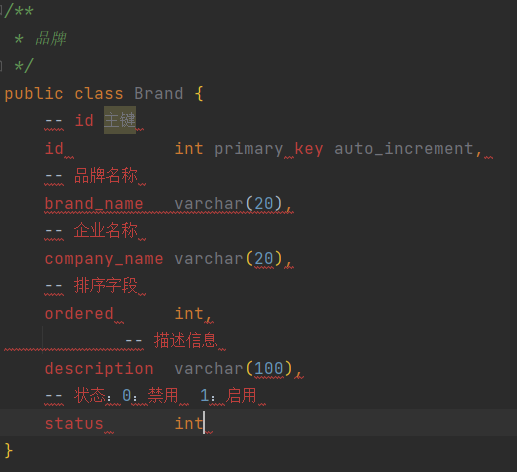

# 1. Java实体类的快速构建

因为这里需要对应于数据库表里面的字段，正常情况我们要按照类型、变量名（最好相同，规范）一模一样写，就会很麻烦，所以快捷键+快捷操作又来了，强大的IDEA。

1. 我们先直接直接把数据库里面的设计字段的代码复制到实体类里面

   

   

2. 分析，我们首先要把sql语法里面这个  ”--“  改成java里面的  ” // “  的注释写法

   快捷键：**Crtl + R**——IDEA里面的快速搜素加替换快捷键，超级好用。

   

3. 然后我们需要把sql里面这个声明变量类型的给换成分号；  先把这部分代码移到右边一点，让他们单独成一列的这种。

   快捷键：**ALT+ 鼠标左键**——然后全部选择他们，按列选择整体，输入分号；

   

   

4. 现在先不要乱动哦，保证光标依然选择的是这几行。然后我们一步步左移到，变量的前面。统一先全部用String类型。其他的类型，我们最后一个个改，

   ==在实体类中，基本数据类型建议使用其对应的包装类型==,因为基本数据类型的默认值有的是有数据的，例如int的默认值为0，但0这个在数据库里面是有实际意义的，会对业务造成巨大影响，而包装类都是对象，默认值为null。

   

5. 最后格式化Crtl + ALt + L。舒舒服服舒舒服服

   

6. 写好Getter、Setter、toString（）。

# 2. 为什么把Service定义成接口

在 `com.itheima.service` 包下创建 `BrandService` 接口，在该接口中定义查询所有的抽象方法

```java
public interface BrandService {

    /**
     * 查询所有
     * @return
     */
    List<Brand> selectAll();
}
```

并在 `com.itheima.service` 下再创建 `impl` 包；`impl` 表示是放 service 层接口的实现类的包。 在该包下创建名为 `BrandServiceImpl` 类

```java
public class BrandServiceImpl implements BrandService {

    @Override
    public List<Brand> selectAll() {
    }
}
```

此处为什么要给 service 定义接口呢？因为service定义了接口后，在 servlet 中就可以使用多态的形式创建Service实现类的对象，如下：


==这里使用多态是因为方便我们后期解除 `Servlet` 和 `service` 的耦合==。从上面的代码我们可以看到 `SelectAllServlet` 类和 `BrandServiceImpl` 类之间是耦合在一起的，如果后期 `BrandService` 有其它更好的实现类（例如叫 `BrandServiceImpl`），那就需要修改 `SelectAllServlet` 类中的代码。后面我们学习了 `Spring` 框架后就可以解除 `SelectAllServlet` 类和红色框括起来的代码耦合。而现在咱们还做不到解除耦合，在这里只需要理解为什么定义接口即可。

==其次的原因：我们可以写多个版本的业务层的实现方式==，我们可以写多个版本的Impl实现类，这样可以对比各种实现方式，对比性能选出最优。

`BrandServiceImpl` 类代码如下：

```java
public class BrandServiceImpl implements BrandService {
    //1. 创建SqlSessionFactory 工厂对象
    SqlSessionFactory factory = SqlSessionFactoryUtils.getSqlSessionFactory();

    @Override
    public List<Brand> selectAll() {
        //2. 获取SqlSession对象
        SqlSession sqlSession = factory.openSession();
        //3. 获取BrandMapper
        BrandMapper mapper = sqlSession.getMapper(BrandMapper.class);

        //4. 调用方法
        List<Brand> brands = mapper.selectAll();

        //5. 释放资源
        sqlSession.close();

        return brands;
    }
}
```

